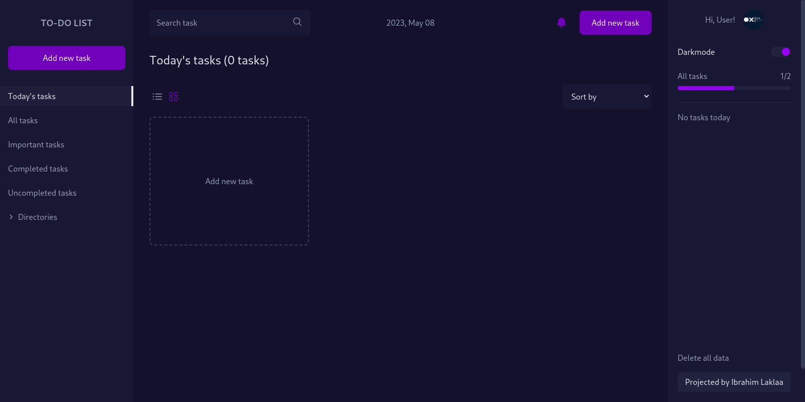

## Descrição
- Esse projeto foi desenvolvido durante a certificação Desenvolvimento Web Fullstack da Trybe
- O projeto em questão é um aplicativo de gerenciamento de tarefas, podendo ser adicionado, excluído, atualizado e editado as tarefas do usuário
- Além das operações básicas de um CRUD, foi atribuído funcionalidades como drag in drop de clique e arrasto das tarefas
- Foi desenvolvido um menu de categorias de acordo com o status da tarefa, exibindo todas, tarefas imcompletas, arquivadas.

  ## Stacks Utilizadas

- React JS
- TypeScript
- Tailwind CSS
- Redux Toolkit
- React Router DOM
- HTML

Como executar o projeto:

clone project
```
git clone https://github.com/aridsm/tasks-app.git
```
go to projet
```
cd tasks-app
```
install npm
```
npm install
```
start project
```
npm start
```


